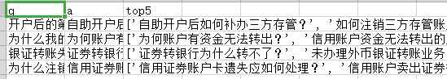

# fwwb14_semantic_similarity
服务外包大赛19年选题14-运用文本相似度实现（证券）智能客服【恒生电子】，回笼觉国家队代码


# How to use

- 在`./data/test/row/test.csv`文件内按照格式填写客户询问，如图：

  

- 运行`create_test.py`，获得处理好的测试集

- 运行`generate_result.py`，得出**top1**结果和**top5**结果，在`./result.csv`，如图：

  

- 若增加标准问，则在‘./data/test/row/standard_question.csv’内在’a’列增加元素即可，其他步骤不变


# Ticks

```
1) Spacy爬虫；

2) 数据处理与可视化；

3) 数据清洗;

4) 单次级别和字符级别输入；

5) 特征工程Magic Feature；

6) RNN模型搭建；

7) 炼丹调参；

8) 模型融合；
```

# Reference

- [atec](<https://github.com/zle1992/atec>)
- [经验分享：关于预训练词向量](<https://zhuanlan.zhihu.com/p/55320266>)
